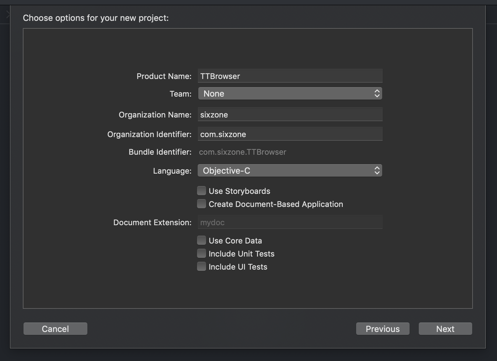

## 项目生成

#### 创建 TTBrowser 项目


#### 在 TTBrowser 项目内创建Target, 名字为：TTBrowser Helper 


## 创建基本代码

#### TTBrowser
删除 AppDelegate.h AppDelegate.m MainMenu.xib <br>
将 TTBrowser 配置中的 Main interface 设置为空 <br>
将 main.m 改名为 main.mm, 并用如下内容替代 <br>
```C
#import <Cocoa/Cocoa.h>

#include "include/cef_app.h"
#include "include/wrapper/cef_library_loader.h"
#include "include/views/cef_browser_view.h"

class SZApp : public CefApp {
public:
    SZApp() {}
private:
    // Include the default reference counting implementation.
    IMPLEMENT_REFCOUNTING(SZApp);
};

class SZBrowserHandler : public CefClient {
public:
    SZBrowserHandler() {}
private:
    // Include the default reference counting implementation.
    IMPLEMENT_REFCOUNTING(SZBrowserHandler);
};


@interface RootView : NSView
@end
@implementation RootView
- (void)viewWillMoveToWindow:(NSWindow *)newWindow {
    CefRefPtr<SZBrowserHandler> handler(new SZBrowserHandler());
    CefBrowserSettings browser_settings;
    CefWindowInfo info;
    
    info.SetAsChild(self,
                    self.bounds.origin.x,
                    self.bounds.origin.y,
                    self.bounds.size.width,
                    self.bounds.size.height
                    );
    
    CefBrowserHost::CreateBrowserSync(info,
                                      handler,
                                      "https://bing.com",
                                      browser_settings,
                                      nil);
}
@end

@interface AppDelegate : NSObject <NSApplicationDelegate>
@end
@implementation AppDelegate
- (void)applicationDidFinishLaunching:(NSNotification *)aNotification {
    // Create Window
    NSSize screenSize = [NSScreen mainScreen].frame.size;
    CGFloat winWidth = screenSize.width * 0.8;
    CGFloat winHeight = screenSize.height * 0.8;
    
    NSWindow *win = [[NSWindow alloc]
                     initWithContentRect: NSMakeRect((screenSize.width - winWidth)/2,
                                                     (screenSize.height - winHeight) /2,
                                                     winWidth,
                                                     winHeight)
                     styleMask: NSWindowStyleMaskTitled | NSWindowStyleMaskResizable
                     backing: NSBackingStoreBuffered
                     defer: true];
    [win makeKeyAndOrderFront:nil];
    
    // Add RootView
    NSView* rootView = [[RootView alloc] initWithFrame:win.contentView.bounds];
    rootView.autoresizingMask = NSViewWidthSizable | NSViewHeightSizable;
    [[win contentView] addSubview:rootView];
}
@end

// Entry Point
int main(int argc, char* argv[]) {
    @autoreleasepool {
        // Load the CEF framework library at runtime
        CefScopedLibraryLoader library_loader;
        if (!library_loader.LoadInMain())
            return 1;
        
        // Provide CEF with command-line arguments.
        CefMainArgs main_args(argc, argv);
        
        // Initialize CEF for the browser process.
        CefSettings settings;
        CefRefPtr<SZApp> app(new SZApp);
        CefInitialize(main_args, settings, app.get(), NULL);
        
        // Create the application delegate.
        AppDelegate* appDelegate = [[AppDelegate alloc] init];
        NSApplication.sharedApplication.delegate = appDelegate;
        
        // Run the CEF message loop. This will block until CefQuitMessageLoop() is called.
        CefRunMessageLoop();
        CefShutdown();
    }
    return 0;
}
```

#### TTBrowser Helper
删除 AppDelegate.h AppDelegate.m MainMenu.xib <br>
将 TTBrowser Helper 配置中的 Main interface 设置为空 <br>
将 main.m 改名为 main.mm, 并用如下内容替代 <br>
```C
#include "include/cef_app.h"
#include "include/wrapper/cef_library_loader.h"
#include "include/cef_sandbox_mac.h"

// Entry point function for sub-processes.
int main(int argc, char* argv[]) {
    // Initialize the macOS sandbox for this helper process.
    CefScopedSandboxContext sandbox_context;
    if (!sandbox_context.Initialize(argc, argv))
        return 1;
    
    // Load the CEF framework library at runtime instead of linking directly
    // as required by the macOS sandbox implementation.
    CefScopedLibraryLoader library_loader;
    if (!library_loader.LoadInHelper())
        return 1;
    
    // Provide CEF with command-line arguments.
    CefMainArgs main_args(argc, argv);
    
    // Execute the sub-process.
    return CefExecuteProcess(main_args, NULL, NULL);
}
```

## 配置项目

#### Header Search Path
配置为 $(SRCROOT)/libs/cef <br>


#### Other Linker Flags
配置 -framework Cocoa $(SRCROOT)/libs/cef/$(CONFIGURATION)/libcef_dll_wrapper.a $(SRCROOT)/libs/cef/$(CONFIGURATION)/cef_sandbox.a <br>


#### Other Warning Flags
配置为 '-mmacosx-version-min=10.11'


#### Suspicious Commas
配置为No


#### 取消签名


## 打包 framework 和 Helper 程序
在主项目中，Build Phase 中加入以下脚本
```bash
LIBPATH=${SRCROOT}"/libs"
CEFPATH=${LIBPATH}"/cef"

if ! [ -x "$(command -v brew)" ]; then
    echo 'Error: brew is not installed.' >&2
    exit 1
fi

if ! [ -x "$(command -v cmake)" ]; then
    brew install cmake
fi

if ! [ -x "$(command -v carthage)" ]; then
    brew install carthage
fi

if [ ! -d ${LIBPATH} ]; then
    mkdir -p ${LIBPATH}
fi

# install libcef
if [ ! -d ${CEFPATH} ]; then
    mkdir -p ${CEFPATH}
    cd ${CEFPATH}

    # download
    curl http://opensource.spotify.com/cefbuilds/cef_binary_3.3626.1886.g162fdec_macosx64.tar.bz2 -o cef_binary.tar.bz2
    tar -xf cef_binary.tar.bz2

    # build
    cd cef_binary_**_macosx64
    mkdir build
    cd build
    cmake -G "Xcode" ..
    for CONFIG in Debug Release
        do
        xcodebuild -target ALL_BUILD -configuration ${CONFIG} build
        cp -r ../${CONFIG} ../../
        cp ./libcef_dll_wrapper/${CONFIG}/libcef_dll_wrapper.a ../../${CONFIG}/
        done
    cp -r ../include ../../

    # clean up
    cd ../../
    rm -rf cef_binary.tar.bz2
fi

# install SVGKit
if [ ! -d ${LIBPATH}"/Carthage" ]; then
    rm -rf ${LIBPATH}/"Cartfile"
    rm -rf ${LIBPATH}/"Cartfile.resolved"

    echo "github \"SVGKit/SVGKit\" \"3.x\"" > ${LIBPATH}/"Cartfile"

    cd ${LIBPATH}
    carthage update
fi

# copy libs
Contents="${BUILT_PRODUCTS_DIR}/${TARGET_NAME}.app/Contents"
rm -rf "${Contents}/Frameworks"
mkdir -p "${Contents}/Frameworks"
cp -r "${SRCROOT}/libs/cef/${CONFIGURATION}/Chromium Embedded Framework.framework" "${Contents}/Frameworks/"
cp -r "${SRCROOT}/libs/Carthage/Build/Mac/CocoaLumberjack.framework" "${Contents}/Frameworks/"
cp -r "${SRCROOT}/libs/Carthage/Build/Mac/SVGKit.framework" "${Contents}/Frameworks/"
cp -r "${BUILT_PRODUCTS_DIR}/${TARGET_NAME} Helper.app" "${Contents}/Frameworks/"
```


## 让Helper程序随主程序一起编译


